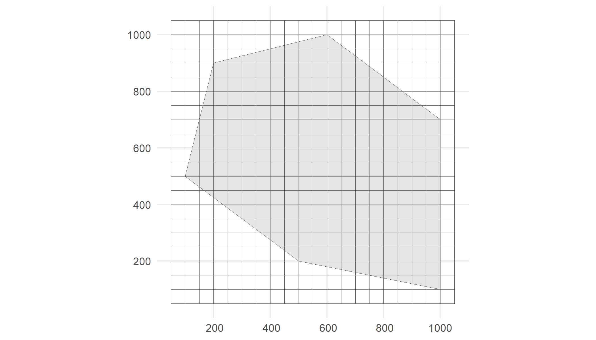
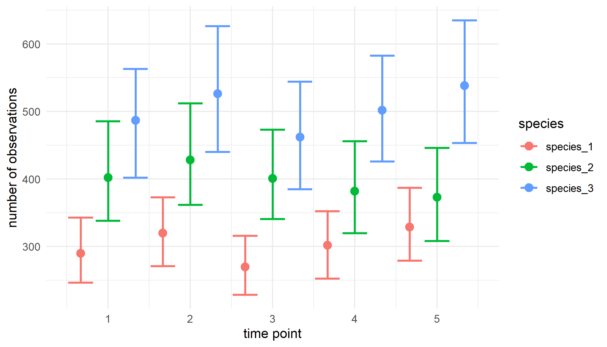

<!-- b3verse.md is generated from b3verse.Rmd Please edit that file -->

:::tip[Explore]
Explore the [b3verse website](https://b-cubed-eu.r-universe.dev/).
:::


[](https://b-cubed-eu.r-universe.dev/)
[](https://b-cubed-eu.r-universe.dev/)
[](https://b-cubed-eu.r-universe.dev/packages)
[](https://b-cubed-eu.r-universe.dev/articles)
[](https://b-cubed-eu.r-universe.dev/datasets)

This guide provides an overview of the integration and maintenance of R packages designed for working with occurrence cubes.

Suggestion citation:

> Langeraert W, Desmet P, Van Daele T (2026). b3verse: A collection of R packages to work with occurrence cubes. Version 1.0. <https://docs.b-cubed.eu/guides/b3verse/>

<a href="https://b-cubed-eu.r-universe.dev/"></a>

## What is the b3verse?

The **b3verse** is a collection of related R packages that support the entire workflow of working with occurrence cubes. This includes data retrieval, cube simulation, data processing, exploration, indicator calculation, and uncertainty estimation. These packages are accessible and maintained via a [dedicated R-universe platform](https://b-cubed-eu.r-universe.dev/), ensuring continuous updates, easy distribution, and efficient [installation](#installation).

In addition to the R packages, the **b3verse** also includes a dedicated [data package](https://doi.org/10.5281/zenodo.15181097), **b3data**, published in the [Frictionless Data](https://frictionlessdata.io/) format. This package provides datasets that can be used directly with the **b3verse software**, including example occurrence cubes and spatial reference layers. For more information, visit the [b3data documentation](https://docs.b-cubed.eu/guides/b3data/).


## Installation

Install or update all packages of the **b3verse** via this command in R:

```r
pkgs <- rownames(available.packages(repos = "https://b-cubed-eu.r-universe.dev"))
install.packages(pkgs, repos = c("https://b-cubed-eu.r-universe.dev", "https://cloud.r-project.org", "https://bioc.r-universe.dev"))
```

If you only want to install the **b3verse** packages you do not have yet, you can install them via:

```r
pkgs <- rownames(available.packages(repos = "https://b-cubed-eu.r-universe.dev"))
pkgs_to_install <- setdiff(pkgs, rownames(installed.packages()))
if (length(pkgs_to_install) > 0) {
  install.packages(pkgs_to_install, repos = c("https://b-cubed-eu.r-universe.dev", "https://cloud.r-project.org", "https://bioc.r-universe.dev"))
}
```

The following packages are currently included:

| Package | Description | GitHub repository |
| :-----  | :---------- | :---------------- |
| **b3doc**        | Create Markdown pages for the B-Cubed documentation website                      | [https://github.com/b-cubed-eu/b3doc](https://github.com/b-cubed-eu/b3doc)               |
| **b3gbi**        | Calculate general biodiversity indicators from occurrence cubes                  | [https://github.com/b-cubed-eu/b3gbi](https://github.com/b-cubed-eu/b3gbi)               |
| **dissmapr**     | Analyse and map multi-site compositional dissimilarity (ζ-diversity)             | [https://github.com/b-cubed-eu/dissmapr](https://github.com/b-cubed-eu/dissmapr)         |
| **dubicube**     | Data exploration for occurrence cubes and uncertainty calculation for indicators | [https://github.com/b-cubed-eu/dubicube](https://github.com/b-cubed-eu/dubicube)         |
| **ebvcube**      | Access and visualise datacubes of Essential Biodiversity Variables (EBV)         | [https://github.com/EBVcube/ebvcube](https://github.com/EBVcube/ebvcube)                 |
| **gcube**        | Simulation of occurrence cubes                                                   | [https://github.com/b-cubed-eu/gcube](https://github.com/b-cubed-eu/gcube)               |
| **impIndicator** | Calculate alien impact indicators from occurrence cubes                          | [https://github.com/b-cubed-eu/impIndicator](https://github.com/b-cubed-eu/impIndicator) |
| **invasimapr** | Estimate and map invasion fitness (λ)                                              | [https://github.com/b-cubed-eu/invasimapr](https://github.com/b-cubed-eu/invasimapr)     |
| **pdindicatoR**  | Calculate phylogenetic indicators from occurrence cubes                          | [https://github.com/b-cubed-eu/pdindicatoR](https://github.com/b-cubed-eu/pdindicatoR)   |
| **rgbif**        | Download occurrence cubes                                                        | [https://github.com/ropensci/rgbif](https://github.com/ropensci/rgbif)                   |
| **trias**        | Functionality for the TrIAS and LIFE RIPARIAS projects                           | [https://github.com/trias-project/trias](https://github.com/trias-project/trias)         |

Note that any dependencies not available in mainstream repositories are also added to the R-universe platform. These dependencies will be installed automatically but are not explicitly listed above.

Individual packages can be installed separately, for example:

```r
install.packages("dubicube", repos = c("https://b-cubed-eu.r-universe.dev", "https://cloud.r-project.org"))
```

For packages with Bioconductor dependencies, the Bioconductor repository must be included:

```r
install.packages("ebvcube", repos = c("https://b-cubed-eu.r-universe.dev", "https://cloud.r-project.org", "https://bioc.r-universe.dev"))
```

## Contributing and reporting issues

We welcome contributions to the **b3verse**! Each package in the collection has its own GitHub repository, where you can find contributing guidelines and report issues.  

**How to contribute?**
- Before contributing, check the *Contributing Guidelines* in the relevant repository (see the [table above](#installation) for links).  
- Contributions can include bug fixes, feature requests, documentation improvements, or new functionality.  

**Reporting bugs or suggesting improvements**
- If you encounter a problem or like to suggest an improvement, open an issue in the corresponding package repository.  
- Be as detailed as possible when describing the issue, including R session info, error messages, and reproducible examples if applicable.

**Adding or removing packages**
- Open an issue and/or pull request in the [b3verse development repository](https://github.com/b-cubed-eu/b-cubed-eu.r-universe.dev/).
- Clearly describe the purpose of the package and how it integrates with the existing **b3verse**.
- Newly proposed packages will undergo a review in line with the [B-Cubed software development guidelines](https://docs.b-cubed.eu/guides/software-development/).

## Getting started
### The b3verse indicator calculation workflow

Occurrence cubes can be derived from GBIF data using the **rgbif** package or simulated using the **gcube** package.
They are then processed using the `process_cube()` function from the **b3gbi** package.
This ensures standardised input data across all indicator packages and verifies that the data format is correct.
Data exploration steps can be performed using **dubicube**.
Once the data cubes are processed, indicators can be calculated with **b3gbi**, **pdindicatoR** or **impIndicator**.
The **dubicube** package enables uncertainty estimation via bootstrapping. It is not a strict dependency of the indicator calculation packages, as it can also be used with custom indicator functions.


### Example workflow

We provide a basic example of an analysis workflow using the **b3verse** packages.
This example demonstrates the process but is not intended as a best-practice analysis.
For more detailed guidance, refer to the package tutorials.  

In this workflow, we use **gcube** v1.4.1 to simulate an occurrence cube, **b3gbi** v0.6.3 to process the cube, and **dubicube** v0.11.0 to calculate uncertainty around indicator estimates.


``` r
# Load packages
library(gcube)     # simulate occurrence cubes
library(b3gbi)     # process occurrence cubes
library(dubicube)  # uncertainty calculation for occurrence cubes

library(sf)        # work with spatial objects
library(dplyr)     # data wrangling
library(ggplot2)   # data visualisation
```

#### Simulate occurrence cube

As input, we create a polygon in which we simulate occurrences.
It represents the spatial extent of the species.
We also need a grid.
Each observation will be designated to a grid cell.


``` r
# Create polygon
polygon <- st_polygon(list(cbind(c(500, 1000, 1000, 600, 200, 100, 500),
                                 c(200, 100, 700, 1000, 900, 500, 200))))

# Create grid
cube_grid <- st_make_grid(
  st_buffer(polygon, 50),
  n = c(20, 20),
  square = TRUE) %>%
  st_sf()

# Visualise
ggplot() +
  geom_sf(data = polygon) +
  geom_sf(data = cube_grid, alpha = 0) +
  theme_minimal()
```



We simulate three species for 5 time points where each species has a different average total number of occurrences at time point one and a different spatial clustering (see also [this tutorial](https://b-cubed-eu.github.io/gcube/articles/multi-species-approach.html)).


``` r
# Create dataframe with simulation function arguments
multi_species_args <- tibble(
  species = paste("species", 1:3, sep = "_"),
  species_key = 1:3,
  species_range = rep(list(polygon), 3),
  initial_average_occurrences = c(300, 400, 500),
  n_time_points = rep(5, 3),
  temporal_function = c(NA, simulate_random_walk, NA),
  sd_step = c(NA, 10, NA),
  spatial_pattern = c("random", "clustered", "clustered"),
  coords_uncertainty_meters = 25,
  grid = rep(list(cube_grid), 3),
  seed = 123
)

# How does this dataframe look like?
glimpse(multi_species_args)
#> Rows: 3
#> Columns: 11
#> $ species                     <chr> "species_1", "species_2", "species_3"
#> $ species_key                 <int> 1, 2, 3
#> $ species_range               <list> [POLYGON ((500 200, 1000 100...], [POLYGON…
#> $ initial_average_occurrences <dbl> 300, 400, 500
#> $ n_time_points               <dbl> 5, 5, 5
#> $ temporal_function           <list> NA, function (initial_average_occurrences …
#> $ sd_step                     <dbl> NA, 10, NA
#> $ spatial_pattern             <chr> "random", "clustered", "clustered"
#> $ coords_uncertainty_meters   <dbl> 25, 25, 25
#> $ grid                        <list> [<sf[400 x 1]>], [<sf[400 x 1]>], [<sf[40…
#> $ seed                        <dbl> 123, 123, 123
```

We simulate the datacube with these arguments.


``` r
# Simulate occurrence cube
occurrence_cube_full <- multi_species_args %>%
  gcube::map_simulate_occurrences() %>%
  gcube::map_sample_observations() %>%
  gcube::map_filter_observations() %>%
  gcube::map_add_coordinate_uncertainty() %>%
  gcube::map_grid_designation(nested = FALSE)
#> [1] [using unconditional Gaussian simulation]
#> [2] [using unconditional Gaussian simulation]
#> [3] [using unconditional Gaussian simulation]

# Select relevant columns
occurrence_cube_df <- occurrence_cube_full %>%
  select("cell_code", "time_point", "species", "species_key", "n",
         "min_coord_uncertainty")

# Visualise
glimpse(occurrence_cube_df)
#> Rows: 6,000
#> Columns: 6
#> $ cell_code             <chr> "105", "108", "109", "110", "111", "112", "113",…
#> $ time_point            <int> 1, 1, 1, 1, 1, 1, 1, 1, 1, 1, 1, 1, 1, 1, 1, 1, …
#> $ species               <chr> "species_1", "species_1", "species_1", "species_…
#> $ species_key           <int> 1, 1, 1, 1, 1, 1, 1, 1, 1, 1, 1, 1, 1, 1, 1, 1, …
#> $ n                     <int> 1, 1, 1, 1, 2, 3, 2, 2, 1, 1, 2, 2, 3, 2, 2, 2, …
#> $ min_coord_uncertainty <dbl> 25, 25, 25, 25, 25, 25, 25, 25, 25, 25, 25, 25, …
```

#### Process occurrence cube

We process our simulated cube using the `process_cube()` function from the **b3gbi** package.
This ensures standardisation and verifies a correct data format.


``` r
# Process cube
processed_cube <- b3gbi::process_cube(
  cube_name = occurrence_cube_df,
  grid_type = "custom",
  cols_cellCode = "cell_code",
  cols_year = "time_point",
  cols_species = "species",
  cols_speciesKey = "species_key",
  cols_occurrences = "n",
  cols_minCoordinateUncertaintyInMeters = "min_coord_uncertainty"
)

processed_cube
#> 
#> Simulated data cube for calculating biodiversity indicators
#> 
#> Date Range: 1 - 5 
#> Number of cells: 400 
#> Grid reference system: custom 
#> Coordinate range:
#> [1] "Coordinates not provided"
#> 
#> Total number of observations: 6012 
#> Number of species represented: 3 
#> Number of families represented: Data not present 
#> 
#> Kingdoms represented: Data not present 
#> 
#> First 10 rows of data (use n = to show more):
#> 
#> # A tibble: 6,000 × 6
#>    cellCode  year scientificName taxonKey   obs minCoordinateUncertaintyInMeters
#>    <chr>    <dbl> <chr>             <dbl> <dbl>                            <dbl>
#>  1 105          1 species_1             1     1                               25
#>  2 108          1 species_1             1     1                               25
#>  3 109          1 species_1             1     1                               25
#>  4 110          1 species_1             1     1                               25
#>  5 111          1 species_1             1     2                               25
#>  6 112          1 species_1             1     3                               25
#>  7 113          1 species_1             1     2                               25
#>  8 117          1 species_1             1     2                               25
#>  9 118          1 species_1             1     1                               25
#> 10 119          1 species_1             1     1                               25
#> # ℹ 5,990 more rows
```

#### Indicator calculation

Finally, we calculate a simple indicator: the total number of observations are there in the cube per year.


``` r
total_abundance <- function(cube) {
  cube %>%
    summarise(
      diversity_val = sum(obs),
      .by = "year"
    )
}
```

The values are calculated and added to a new column `diversity_val`.


``` r
total_abundance(processed_cube$data)
#> # A tibble: 5 × 2
#>    year diversity_val
#>   <dbl>         <dbl>
#> 1     1          1179
#> 2     2          1274
#> 3     3          1133
#> 4     4          1186
#> 5     5          1240
```

We use bootstrapping to calculate uncertainty around the estimates.
We calculate the 95 % percentile interval for each estimate.


``` r
# Perform bootstrapping
bootstrap_observations <- dubicube::bootstrap_cube(
  data_cube = processed_cube,
  fun = total_abundance,
  grouping_var = "year",
  samples = 1000,
  seed = 123
)
#> [1] "Performing group-specific bootstrap with `boot::boot()`."

# Calculate percentile intervals
ci_observations <- dubicube::calculate_bootstrap_ci(
  bootstrap_results = bootstrap_observations,
  grouping_var = "year",
  type = "perc",
  conf = 0.95
)

ci_observations
#>   year est_original int_type       ll       ul conf
#> 1    1         1179     perc 1081.025 1271.000 0.95
#> 2    2         1274     perc 1166.051 1373.000 0.95
#> 3    3         1133     perc 1047.000 1229.949 0.95
#> 4    4         1186     perc 1088.025 1280.975 0.95
#> 5    5         1240     perc 1145.025 1344.000 0.95
```

We visualise the results.


``` r
ci_observations %>%
  ggplot(aes(x = year, y = est_original)) +
    geom_errorbar(aes(ymin = ll, ymax = ul), width = 0.5) +
    geom_point(size = 3, position = position_dodge(1)) +
    labs(y = "number of observations", x = "time point") +
    theme_minimal()
```


