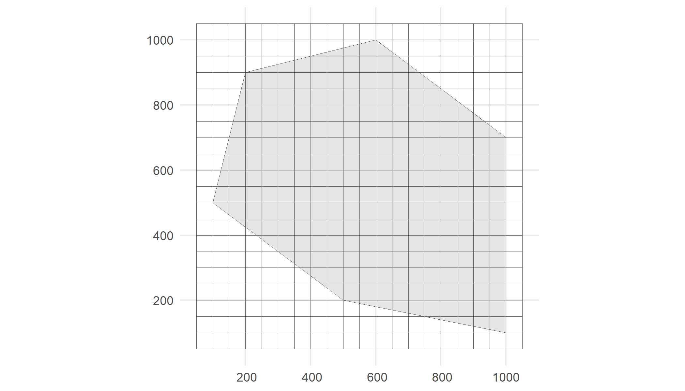
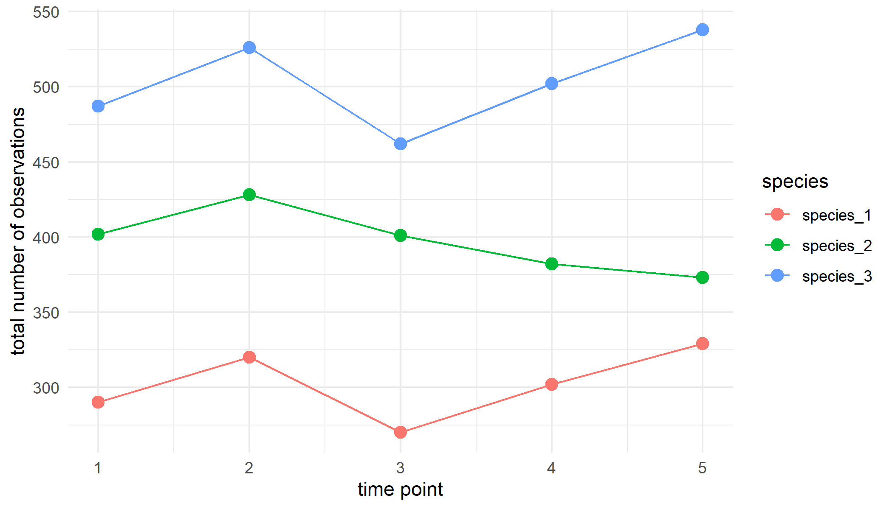

<!-- b3verse.md is generated from b3verse.Rmd Please edit that file -->


This guide provides an overview of the integration and maintenance of R packages designed for calculating biodiversity indicators from occurrence cubes.

Suggestion citation:

> Langeraert W, Desmet P, Van Daele T (2025). Welcome to the b3verse! A collection of R packages for indicator calculation from occurrence cubes. <https://docs.b-cubed.eu/guides/b3verse/>

<a href="https://b-cubed-eu.r-universe.dev/"></a>

## What is the b3verse?

The **b3verse** is a collection of related R packages that streamline indicator calculation from occurrence cubes. These packages are accessible and maintained via a [dedicated R-universe platform](https://b-cubed-eu.r-universe.dev/), ensuring continuous updates, easy distribution, and efficient [installation](#installation).


## Installation

Install all packages of the **b3verse** via this command in R:

```r
pkgs <- available.packages(repos = "https://b-cubed-eu.r-universe.dev")[, "Package"]
install.packages(pkgs, repos = "https://b-cubed-eu.r-universe.dev")
```

The following packages are currently included:

| Package | Description | GitHub repository |
| :-----: | :---------- | :---------------- |
| **rgbif** | Download occurrence cubes | <https://github.com/ropensci/rgbif> |
| **gcube** | Simulation of occurrence cubes | <https://github.com/b-cubed-eu/gcube> |
| **b3gbi** | Calculate general biodiversity indicators from occurrence cubes | <https://github.com/b-cubed-eu/b3gbi> |
| **pdindicatoR** | Calculate phylogenetic indicators from occurrence cubes | <https://github.com/b-cubed-eu/pdindicatoR> |
| **impIndicatoR** | Calculate alien impact indicators from occurrence cubes | <https://github.com/b-cubed-eu/impIndicator> |
| **dubicube** | Data exploration for occurrence cubes and uncertainty calculation for indicators | <https://github.com/b-cubed-eu/dubicube> |

Note that any dependencies not available in mainstream repositories are also added to the R-universe platform. These dependencies will be installed automatically but are not explicitly listed above.

## Contributing and reporting issues

We welcome contributions to the **b3verse**! Each package in the collection has its own GitHub repository, where you can find contributing guidelines and report issues.  

**How to contribute?**
- Before contributing, check the "Contributing Guidelines" in the relevant repository (see the [table above](#installation) for links).  
- Contributions can include bug fixes, feature requests, documentation improvements, or new functionality.  

**Reporting bugs or suggesting improvements**
- If you encounter an issue or have an idea for improvement, open an "issue" in the corresponding package repository.  
- Be as detailed as possible when describing the issue, including R session info, error messages, and reproducible examples if applicable.

## Getting started
### The b3verse workflow

Occurrence cubes can be derived from GBIF data using the **rgbif** package or simulated using the **gcube** package.
They are then processed using the `process_cube()` function from the **b3gbi** package.
This ensures standardised input data across all indicator packages and verifies that the data format is correct.
Data exploration steps can be performed using **dubicube**.
Once the data cubes are processed, indicators can be calculated with **b3gbi**, **pdindicatoR** or **impIndicator**.
The **dubicube** package enables uncertainty estimation via bootstrapping. It is not a strict dependency of the indicator calculation packages, as it can also be used with custom indicator functions.


### Example workflow

We provide a basic example of how an analysis workflow could look like using the **b3verse** packages.
We use **gcube** v1.1.2 to simulate an occurrence cube, **b3gbi** v0.4.2 to process the cube, and **dubicube** v0.3.2 to calculate uncertainty around a simple indicator.


``` r
# Load packages
library(gcube)     # simulate occurrence cubes
library(b3gbi)     # process occurrence cubes
library(dubicube)  # uncertainty calculation for occurrence cubes

library(sf)        # work with spatial objects
library(dplyr)     # data wrangling
library(ggplot2)   # data visualisation
```

**Simulate occurrence cube**

As input, we create a polygon in which we simulate occurrences.
It represents the spatial extend of the species.
We also need a grid.
Each observation will be designated to a grid cell.


``` r
# Create polygon
polygon <- st_polygon(list(cbind(c(500, 1000, 1000, 600, 200, 100, 500),
                                 c(200, 100, 700, 1000, 900, 500, 200))))

# Create grid
cube_grid <- st_make_grid(
  st_buffer(polygon, 50),
  n = c(20, 20),
  square = TRUE) %>%
  st_sf()

# Visualise
ggplot() +
  geom_sf(data = polygon) +
  geom_sf(data = cube_grid, alpha = 0) +
  theme_minimal()
```



We simulate three species for 5 time points where each species has a different average total number of occurrences at time point one and a different spatial clustering (see also [this tutoria](https://b-cubed-eu.github.io/gcube/articles/multi-species-approach.html)).


``` r
# Create dataframe with simulation function arguments
multi_species_args <- tibble(
  species = paste("species", 1:3, sep = "_"),
  species_key = 1:3,
  species_range = rep(list(polygon), 3),
  initial_average_occurrences = c(300, 400, 500),
  n_time_points = rep(5, 3),
  temporal_function = c(NA, simulate_random_walk, NA),
  sd_step = c(NA, 10, NA),
  spatial_pattern = c("random", "clustered", "clustered"),
  coords_uncertainty_meters = 25,
  grid = rep(list(cube_grid), 3),
  seed = 123
)

# How does this dataframe look like?
glimpse(multi_species_args)
#> Rows: 3
#> Columns: 11
#> $ species                     <chr> "species_1", "species_2", "species_3"
#> $ species_key                 <int> 1, 2, 3
#> $ species_range               <list> [POLYGON ((500 200, 1000 100...], [POLYGON…
#> $ initial_average_occurrences <dbl> 300, 400, 500
#> $ n_time_points               <dbl> 5, 5, 5
#> $ temporal_function           <list> NA, function (initial_average_occurrences …
#> $ sd_step                     <dbl> NA, 10, NA
#> $ spatial_pattern             <chr> "random", "clustered", "clustered"
#> $ coords_uncertainty_meters   <dbl> 25, 25, 25
#> $ grid                        <list> [<sf[400 x 1]>], [<sf[400 x 1]>], [<sf[40…
#> $ seed                        <dbl> 123, 123, 123
```

We simulate the datacube with these arguments.


``` r
# Simulate occurrence cube
occurrence_cube_full <- multi_species_args %>%
  gcube::map_simulate_occurrences() %>%
  gcube::map_sample_observations() %>%
  gcube::map_filter_observations() %>%
  gcube::map_add_coordinate_uncertainty() %>%
  gcube::map_grid_designation(nested = FALSE)
#> [1] [using unconditional Gaussian simulation]
#> [2] [using unconditional Gaussian simulation]
#> [3] [using unconditional Gaussian simulation]

# Select relevant columns
occurrence_cube_df <- occurrence_cube_full %>%
  select("cell_code", "time_point", "species", "species_key", "n",
         "min_coord_uncertainty")

# Visualise
occurrence_cube_df %>%
  summarise(n_obs = sum(n),
            .by = c(species, time_point)) %>%
  ggplot(aes(x = time_point, y = n_obs, colour = species)) +
  geom_point(size = 3) +
  geom_line() +
  labs(x = "time point", y = "total number of observations") +
  theme_minimal()
```



**Process occurrence cube**

We process our simulated cube using the `process_cube()` function from the **b3gbi** package.
This ensures standarisation and verifies a correct data format.


``` r
# Process cube
processed_cube <- b3gbi::process_cube(
  cube_name = occurrence_cube_df,
  grid_type = "custom",
  cols_cellCode = "cell_code",
  cols_year = "time_point",
  cols_species = "species",
  cols_speciesKey = "species_key",
  cols_occurrences = "n",
  cols_minCoordinateUncertaintyInMeters = "min_coord_uncertainty"
)

processed_cube
#> 
#> Simulated data cube for calculating biodiversity indicators
#> 
#> Date Range: 1 - 5 
#> Number of cells: 400 
#> Grid reference system: custom 
#> Coordinate range:
#> [1] "Coordinates not provided"
#> 
#> Total number of observations: 6012 
#> Number of species represented: 3 
#> Number of families represented: Data not present 
#> 
#> Kingdoms represented: Data not present 
#> 
#> First 10 rows of data (use n = to show more):
#> 
#> # A tibble: 6,000 × 6
#>    cellCode  year scientificName taxonKey   obs minCoordinateUncertaintyInMeters
#>    <chr>    <dbl> <chr>             <dbl> <dbl>                            <dbl>
#>  1 105          1 species_1             1     1                               25
#>  2 108          1 species_1             1     1                               25
#>  3 109          1 species_1             1     1                               25
#>  4 110          1 species_1             1     1                               25
#>  5 111          1 species_1             1     2                               25
#>  6 112          1 species_1             1     3                               25
#>  7 113          1 species_1             1     2                               25
#>  8 117          1 species_1             1     2                               25
#>  9 118          1 species_1             1     1                               25
#> 10 119          1 species_1             1     1                               25
#> # ℹ 5,990 more rows
```

**Indicator calculation**

Finally, we calculate a simple indicator: occupancy ($O_{s,y}$) of species $s$ in year $y$.

$$
O_{s,y} = \frac{N_{s,y}}{N_{\text{total}}}
$$

where:  
- $N_{s,y}$ is the number of grid cells where species $s$ is present in year $y$
- $N_{\text{total}}$ is the total number of grid cells where any species was present in any year


``` r
species_occupancy <- function(cube) {
  # Calculate total number of occupied cells
  total_cells <- length(unique(cube[cube$obs > 0, ]$cellCode))
  
  # Calculate proportion of occupied cells per species per year
  cube %>%
    filter(obs > 1) %>%
    summarise(diversity_val = n_distinct(cellCode) / total_cells,
              .by = c(scientificName, year))
}
```

This gives the proportion of grid cells in which the species occurs (column `diversity_val`).


``` r
species_occupancy(processed_cube$data)
#> # A tibble: 15 × 3
#>    scientificName  year diversity_val
#>    <chr>          <dbl>         <dbl>
#>  1 species_1          1         0.319
#>  2 species_2          1         0.393
#>  3 species_3          1         0.467
#>  4 species_1          2         0.352
#>  5 species_2          2         0.415
#>  6 species_3          2         0.485
#>  7 species_1          3         0.278
#>  8 species_2          3         0.419
#>  9 species_3          3         0.452
#> 10 species_1          4         0.322
#> 11 species_2          4         0.363
#> 12 species_3          4         0.496
#> 13 species_1          5         0.352
#> 14 species_2          5         0.374
#> 15 species_3          5         0.504
```

We use bootstrapping to calculate uncertainty around the estimates. We calculate the 95 % Bias-corrected and accelerated (BCa) interval for each estimate.


``` r
# Perform bootstrapping
bootstrap_occupancy <- dubicube::bootstrap_cube(
  data_cube = processed_cube$data,
  fun = species_occupancy,
  grouping_var = c("scientificName", "year"),
  samples = 1000,
  seed = 123
)

# Calculate BCa intervals
ci_occupancy <- dubicube::calculate_bootstrap_ci(
  bootstrap_samples_df = bootstrap_occupancy,
  grouping_var = c("scientificName", "year"),
  type = "bca",
  conf = 0.95,
  data_cube = processed_cube$data,
  fun = species_occupancy
)
#> Warning in FUN(X[[i]], ...): Estimated adjustment 'z0' is infinite.
#> Warning in FUN(X[[i]], ...): Estimated adjustment 'z0' is infinite.
#> Warning in FUN(X[[i]], ...): Estimated adjustment 'z0' is infinite.
#> Warning in FUN(X[[i]], ...): Estimated adjustment 'z0' is infinite.
#> Warning in FUN(X[[i]], ...): Estimated adjustment 'z0' is infinite.
#> Warning in FUN(X[[i]], ...): Estimated adjustment 'z0' is infinite.
#> Warning in FUN(X[[i]], ...): Estimated adjustment 'z0' is infinite.
#> Warning in FUN(X[[i]], ...): Estimated adjustment 'z0' is infinite.
#> Warning in FUN(X[[i]], ...): Estimated adjustment 'z0' is infinite.
#> Warning in FUN(X[[i]], ...): Estimated adjustment 'z0' is infinite.
#> Warning in FUN(X[[i]], ...): Estimated adjustment 'z0' is infinite.
#> Warning in FUN(X[[i]], ...): Estimated adjustment 'z0' is infinite.
#> Warning in FUN(X[[i]], ...): Estimated adjustment 'z0' is infinite.
#> Warning in FUN(X[[i]], ...): Estimated adjustment 'z0' is infinite.
#> Warning in FUN(X[[i]], ...): Estimated adjustment 'z0' is infinite.

ci_occupancy
#>    scientificName year est_original  est_boot    se_boot   bias_boot int_type
#> 1       species_1    1    0.3185185 0.2049888 0.01661341 -0.11352969      bca
#> 2       species_1    2    0.3518519 0.2266638 0.01726680 -0.12518807      bca
#> 3       species_1    3    0.2777778 0.1789401 0.01560733 -0.09883765      bca
#> 4       species_1    4    0.3222222 0.2074735 0.01675354 -0.11474873      bca
#> 5       species_1    5    0.3518519 0.2262592 0.01747016 -0.12559263      bca
#> 6       species_2    1    0.3925926 0.2516493 0.01906814 -0.14094327      bca
#> 7       species_2    2    0.4148148 0.2673636 0.01918003 -0.14745120      bca
#> 8       species_2    3    0.4185185 0.2693835 0.01878948 -0.14913497      bca
#> 9       species_2    4    0.3629630 0.2330578 0.01787723 -0.12990519      bca
#> 10      species_2    5    0.3740741 0.2403890 0.01849072 -0.13368508      bca
#> 11      species_3    1    0.4666667 0.3010178 0.02022130 -0.16564886      bca
#> 12      species_3    2    0.4851852 0.3115613 0.02122881 -0.17362386      bca
#> 13      species_3    3    0.4518519 0.2909457 0.02027434 -0.16090611      bca
#> 14      species_3    4    0.4962963 0.3195821 0.02102830 -0.17671417      bca
#> 15      species_3    5    0.5037037 0.3235444 0.02237582 -0.18015926      bca
#>    conf ll ul
#> 1  0.95 NA NA
#> 2  0.95 NA NA
#> 3  0.95 NA NA
#> 4  0.95 NA NA
#> 5  0.95 NA NA
#> 6  0.95 NA NA
#> 7  0.95 NA NA
#> 8  0.95 NA NA
#> 9  0.95 NA NA
#> 10 0.95 NA NA
#> 11 0.95 NA NA
#> 12 0.95 NA NA
#> 13 0.95 NA NA
#> 14 0.95 NA NA
#> 15 0.95 NA NA
```

...
